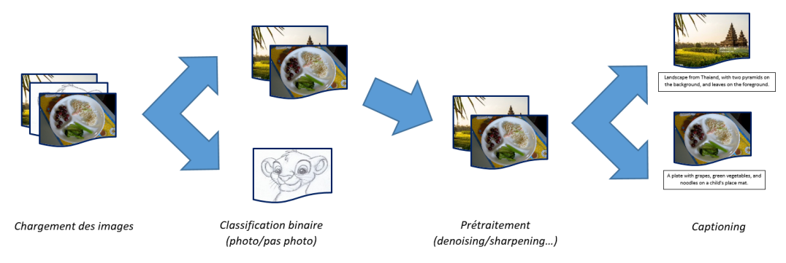

# Projet data science cesi A5

| Auteurs            |
|--------------------|
| Frédéric SPATARO   |
| Oscar PALISSOT     |
| Djayan DEMAISON    |
| Arnaud HITTINGER   |
| Nicolas PELLEGRINI |

## Contexte

La classification binaire s'appuiera sur des réseaux de neurones. Elle permettra de trier les images en deux catégories :
photo, et autre type d'image. A minima, votre algorithme sera capable de différencier entre une photo et un schéma ou un
texte scanné. Idéalement, l'algorithme arrivera à discriminer entre des photos et des peintures (ce qui sera plus
difficile, une peinture risquant d'être plus proche visuellement d'une photo). Tounum a déjà classé un certain nombre
d'images, vous aurez donc un dataset d'images catégorisées pour entraîner votre réseau de neurones.

Le prétraitement s'appuiera sur des notions assez simples autour des filtres de convolution, et les appliquera pour
améliorer la qualité de l'image.

Le Captioning, c'est-à-dire la génération automatique des légendes, utilisera deux techniques avancées de Machine
Learning : les réseaux de neurones récurrents (RNN), et les réseaux de neurones convolutifs (CNN). Si les RNN permettent
de générer les étiquettes, il sera nécessaire de passer avant par des CNN pour pré-traiter les images. Cela va nous
permettre d'identifier les zones d'intérêt dans les images, et de représenter les images en question de manière plus
compacte (parce que si vous devez charger des milliers d'images dans votre RAM, ça va vite devenir coûteux en
performances). Vous vous appuierez sur des dataset d'étiquetage classiques pour effectuer l'apprentissage supervisé.

